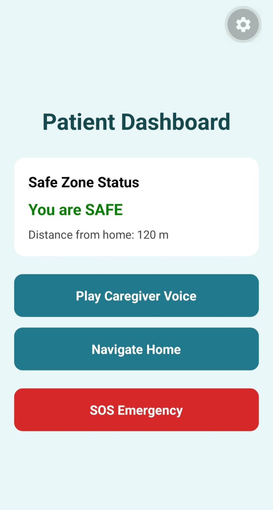
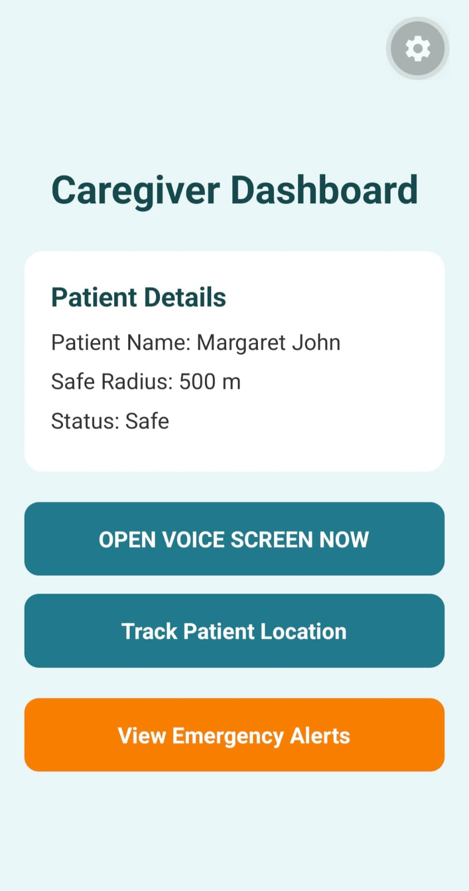

# ReMind – Personalized Voice-Guided Safety Navigation for Alzheimer's Patients

## Overview
ReMind is a mobile application designed to help Alzheimer's patients navigate safely using caregiver voice guidance.

## Features Implemented
- Home Screen
- Patient Dashboard
- Caregiver Dashboard
- Voice Instruction Screen
- Voice Playback
- Emergency Alert Button
- Safe Zone Monitoring

## Technology Stack
- React Native
- Expo Router
- TypeScript
  
## Screenshots

### Home Page

### Patient Dashboard

### Caregiver Dashboard

## Future Enhancements
- GPS Tracking
- Geofencing
- Real-time Caregiver Alerts
- Voice Recognition
- AI-based Safety Monitoring

## Developer
Aneeta Anto
Govt. Model Engineering College
