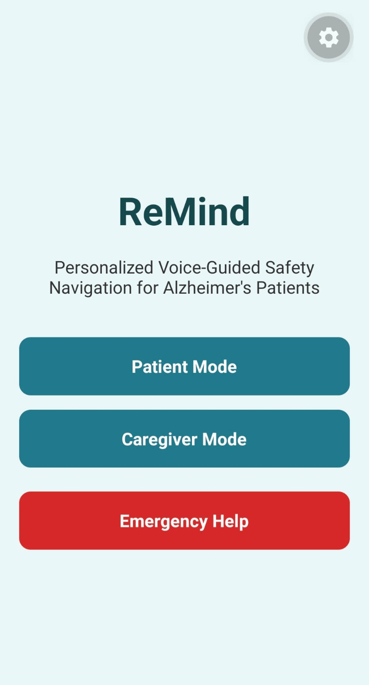
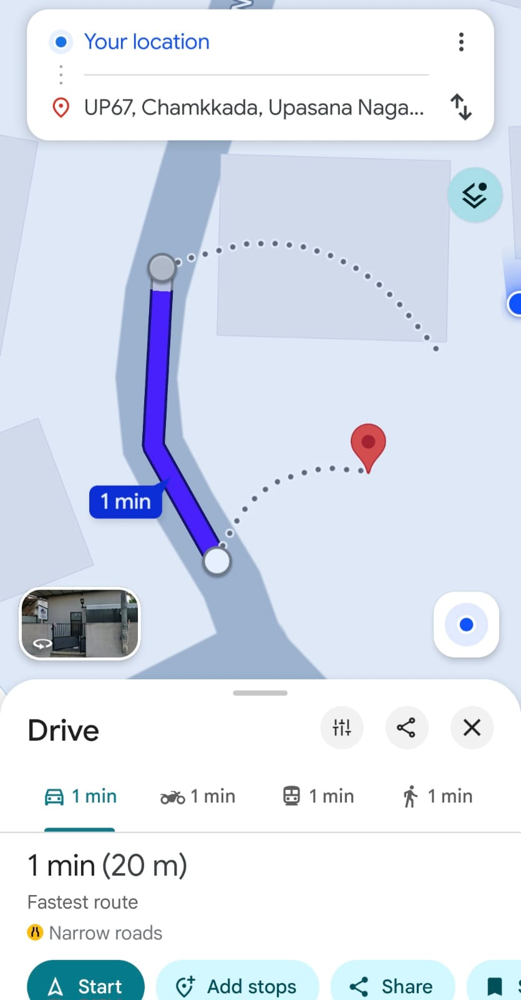

# ReMind – Alzheimer’s Safety Navigation App

ReMind is a mobile application designed to support Alzheimer’s patients and caregivers. The app helps monitor patient safety using GPS, safe-zone detection, caregiver alerts, voice guidance, and Google Maps navigation.

## Features

### 1. User Registration
- Register as Patient or Caregiver
- Save name, phone number, family ID, and safe radius
- Store user details in Firebase

### 2. User Login
- Login using Family ID and phone number
- Opens Patient Dashboard for patients
- Opens Caregiver Dashboard for caregivers

### 3. Patient Dashboard
- Displays patient name
- Shows safe radius
- Shows current GPS location
- Shows distance from home
- Shows safe-zone status

### 4. Live Location Tracking
- Tracks patient location using GPS
- Saves latest patient location to Firebase
- Allows caregiver to view patient location

### 5. Safe Zone Monitoring
- Calculates distance from home
- Detects whether patient is inside or outside safe zone
- Updates status automatically

### 6. Caregiver Voice Guidance
- Caregiver can save calming voice instruction text
- Patient can hear voice guidance using text-to-speech
- Helps reduce panic and confusion

### 7. Emergency Alert System
- Patient can press SOS Emergency
- Alert is saved in Firebase
- Caregiver can view latest emergency alert

### 8. Map Tracking
- Caregiver can open patient location in Google Maps
- Helps caregiver track the patient quickly

### 9. Automatic Navigation Home
- When patient leaves safe zone:
  - Caregiver alert is created automatically
  - Voice guidance plays automatically
  - Google Maps route home opens automatically

## Technology Stack

- React Native
- Expo
- TypeScript
- Firebase Firestore
- Expo Location
- Expo Speech
- Google Maps

## Screenshots

### Home Screen

### Patient Registration

### Caregiver Registration

### Patient Dashboard

### Caregiver Dashboard

### Voice Instruction

### Emergency Alert

### Map Location Tracking

### Navigation Home

## Future Enhancements

- Firebase Authentication
- Push Notifications
- Background Location Tracking
- Multiple Caregiver Support
- Patient Activity History
- Medication Reminders
- Voice Recognition

## Developer

Aneeta Anto  
Government Model Engineering College, Thrikkakara
